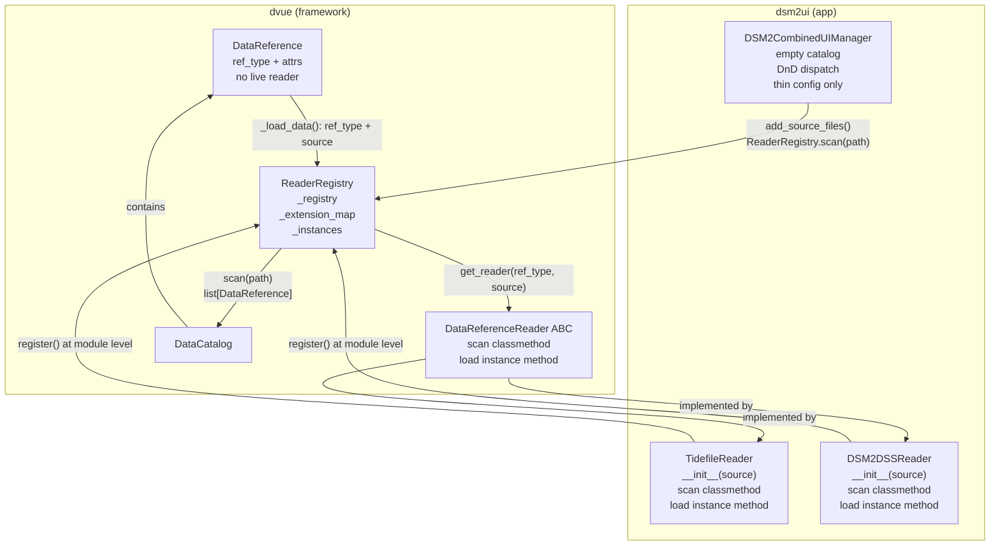

# Reader Registry — Architecture Overview

## Status: Implementation Phase

---

## 1. Background and Problem

The current `dvue` data loading pipeline tightly couples each `DataReference` to its
reader at construction time.  When a `DSM2TidefileUIManager` is built it:

1. Opens every HDF5 file immediately.
2. Builds one `TidefileReader(tidefile_map)` flyweight that holds all open file handles.
3. Passes that shared instance to every `DSM2TidefileDataReference` via `reader=self._reader`.

This works for a single file type but creates several problems:

- **Mixed file types in one session are hard.**  A user dropping a `.dss` file into a
  tidefile session gets nothing; a combined session requires wiring two separate managers.
- **Reader lifecycle is not managed centrally.**  File handles are scattered across
  DataReference objects; the flyweight is an ad-hoc workaround.
- **No "discover what's in this file" path.**  Adding a new file requires manager-specific
  code that opens the file, reads its catalog, and constructs refs manually.
- **DataReference is not serializable.**  Because a live reader instance is embedded, refs
  cannot be cleanly round-tripped to/from CSV without special treatment.

---

## 2. Design Goals

| Goal | Approach |
|------|----------|
| DataReference is a pure data bag | Remove embedded reader from DataReference; store only `ref_type` + attributes |
| Centralized reader lifecycle | One reader instance per `(ref_type, source_path)`, cached in a registry |
| Open/extensible file type support | App code registers reader classes; dvue framework stays domain-agnostic |
| File-to-catalog discovery | Reader classes expose a `scan(path)` classmethod that produces DataReferences |
| DnD dispatch by extension | App registers which extensions its readers handle; framework routes drops |
| Full backward compatibility | Existing `reader=instance` and `reader="fqcn.string"` paths continue working |

---

## 3. Core Concepts

### 3.1 DataReference as a Plain Data Bag

A `DataReference` is identified by two things:

- **`ref_type`** — a string naming the kind of data (e.g. `"dsm2_hdf5"`, `"dsm2_dss"`).
  Set as a class attribute on subclasses; default is `"raw"`.
- **`attributes`** — a flat dict of metadata (source path, station id, variable name, etc.)
  forwarded verbatim to the reader's `load()` call.

The reference carries *no* live objects.  It can be serialized to a CSV row and
reconstructed from it.  Reader access is resolved at load time via the registry.

### 3.2 The ReaderRegistry

`ReaderRegistry` (new, in `dvue/registry.py`) is the single place that maps types to
implementations.  It maintains three class-level structures:

| Structure | Key | Value |
|-----------|-----|-------|
| `_registry` | `ref_type: str` | `reader_class: type[DataReferenceReader]` |
| `_extension_map` | `".h5": str` | `reader_class: type[DataReferenceReader]` |
| `_instances` | `(ref_type, source): tuple` | `reader_instance: DataReferenceReader` |

**Registration** — downstream packages call `ReaderRegistry.register(...)` at module level:

```python
# in dsm2ui/dsm2ui.py, at module level after class definition
ReaderRegistry.register("dsm2_hdf5", TidefileReader, extensions=[".h5", ".hdf5"])
ReaderRegistry.register("dsm2_dss",  DSM2DSSReader,  extensions=[".dss"])
```

**Load-time lookup** — when `DataReference._load_data()` finds no embedded reader it calls:

```python
reader = ReaderRegistry.get_reader(self.ref_type, self.source)
```

The registry creates a `TidefileReader(source)` on the first call for that `(ref_type, source)`
pair and returns the cached instance on all subsequent calls.  This replaces the explicit
flyweight pattern with a registry-level cache that is transparent to the caller.

**File-type dispatch** — when a file is dropped onto the UI, `ReaderRegistry.scan(path)`
looks up the extension, calls the registered class's `scan(path)` classmethod, and returns
a list of DataReferences ready to be added to the catalog.

### 3.3 The Scan / Load Separation

Reader classes have two distinct roles:

| Role | Method | Who calls it | When |
|------|--------|--------------|------|
| **Scan** | `@classmethod scan(cls, path) -> list[DataReference]` | Manager `add_source_files()` via `ReaderRegistry.scan()` | File dropped or explicitly added |
| **Load** | `def load(self, **attributes) -> DataFrame` | `DataReference._load_data()` via `ReaderRegistry.get_reader()` | User requests a time-series plot |

`scan()` is a *classmethod* — it does not need a cached instance.  It opens the file
temporarily, reads its metadata catalog, and closes the handle (or reuses the registry
instance if it already exists).  `load()` is an *instance method* on a cached, stateful
reader that keeps the file handle open for efficient repeated access.

**`scan()` is permissive**: it should emit every attribute the file itself can provide
(id, variable, units, embedded coordinates, start/end timestamps, etc.) — not just the
minimum required for `load()`.  Manager-level enrichment adds only what the file does
*not* contain.  If the same attribute key appears in both the file and the manager's
external lookup, the **file value wins** and a warning is logged.

---

## 4. Component Architecture



---

## 5. Data Flows

### 5.1 File Dropped onto the UI (DnD)

```
User drops file.h5
    │
    ▼
DSM2CombinedUIManager.add_source_files("file.h5")
    │
    ▼
ReaderRegistry.scan("file.h5")           ← extension lookup → TidefileReader
    │
    ▼
TidefileReader.scan("file.h5")           ← classmethod, opens file temporarily
    │  creates DSM2TidefileDataReference(source="file.h5", id=..., variable=...) per row
    │  emits all file-available attrs (incl. embedded geo/units if present)
    ▼
Manager enriches refs via set_attribute() ← geoid, geometry (shapefile), station name (CSV)
    │  all mutation BEFORE catalog.add()  ← file attrs win on conflict; warning logged
    │  time_range expansion kept separate ← UI state, not stored on refs
    ▼
DataCatalog.add(ref) × N                 ← catalog grows; source_num auto-assigned
    │
    ▼
Display table updates                    ← new rows visible to user
```

### 5.2 User Requests a Time-Series Plot

```
User selects row in table
    │
    ▼
DataReference.getData(time_range=...)
    │
    ▼
DataReference._load_data(time_range)
    │   _get_reader() raises ValueError  ← no embedded reader
    ▼
ReaderRegistry.get_reader("dsm2_hdf5", "file.h5")
    │   cache miss on first call → TidefileReader("file.h5") created and cached
    │   cache hit on subsequent calls → same instance returned
    ▼
TidefileReader(source="file.h5").load(id=..., variable=..., time_range=...)
    │
    ▼
DataFrame returned → plotted
```

---

## 6. Layer Boundaries

| Responsibility | Layer | Location |
|----------------|-------|----------|
| `ReaderRegistry` class and caching logic | Framework | `dvue/registry.py` |
| `DataReference._load_data()` fallback to registry | Framework | `dvue/catalog.py` |
| `DataReferenceReader.scan()` abstract base | Framework | `dvue/catalog.py` |
| Registration of `TidefileReader` and `DSM2DSSReader` | App | `dsm2ui/dsm2ui.py` module level |
| Extension → reader class mapping | App | `dsm2ui/dsm2ui.py` module level |
| Enrichment via `ref.set_attribute()` (geoid, geometry, station names) | App | `add_source_files()` — before `catalog.add()` |
| `time_range` UI-state expansion | App | `add_source_files()` — separate from ref attributes |
| Plot action dispatch by `ref_type` | App | `_CombinedPlotAction` in `dsm2ui/dsm2ui.py` |

dvue defines the *interfaces* and the *caching mechanics*; dsm2ui supplies all domain
knowledge (what formats exist, how to open them, what metadata to extract).

---

## 7. Impact on Existing Managers

Both `DSM2TidefileUIManager` and `DSM2DataUIManager` are **fully migrated** (not just the
new combined manager).  After migration:

- DataReferences no longer carry a `reader=` instance.
- `build_catalog_from_dataframe()` accepts `reader=None`.
- `TidefileReader` handles one file per instance; the explicit `tidefile_map` flyweight is
  replaced by the registry's `_instances` cache.
- All existing tests continue to pass because `DataReference._load_data()` falls back to
  the registry transparently.

---

## 8. The New Combined UI Manager

`DSM2CombinedUIManager` is a thin manager that starts with an empty catalog and accepts
any registered file type:

- Starts empty; no files required at construction.
- `add_source_files(*paths)`: calls `ReaderRegistry.scan(path)` for each path, enriches
  HDF5 refs with geoid/geometry, adds all refs to one `DataCatalog`.
- `primary_key = ["source_num", "name"]` — works for both HDF5 and DSS entries.
- Table columns: union of HDF5 and DSS relevant columns (NaN for irrelevant entries).
- Plot action: `_CombinedPlotAction` dispatches to existing per-type plot actions based
  on `ref.ref_type`.
- CLI: `dsm2ui ui combined`.

---

## 9. Enrichment Contract

### 9.1 `scan()` → permissive extraction

The reader's `scan()` classmethod emits every attribute the file itself contains.  It
does **not** know about external lookup tables, shapefiles, or manager configuration.

### 9.2 `add_source_files()` → external enrichment via `set_attribute()`

After `scan()` returns raw refs, the manager calls `ref.set_attribute(name, value)` to
merge external knowledge:

| What | Source | Example |
|------|--------|---------|
| Station display names | Lookup CSV | `geoid` → human name |
| Geometry | `self.channels` GeoDataFrame | spatial join for map rendering |
| `time_range` expansion | Manager UI state | expands widget bounds — **not stored on refs** |

**Conflict rule**: if the file already provides a value for a key the manager lookup also
covers, the **file value is kept** and a warning is emitted.  The manager only sets an
attribute when the ref does not already have it.

### 9.3 Geometry storage

Geometry is stored as a Shapely object via `set_attribute("geometry", geom)`.  This
enables `DataCatalog.to_dataframe()` to return a `GeoDataFrame` for map rendering.
CSV round-trip serialization of geometry (WKT → Shapely) is **deferred**.

### 9.4 Mutation safety rule

All `set_attribute()` calls must complete **before** `catalog.add(ref)`.  Once a ref is
in the catalog it may be read for display at any time.  Mutating load-critical attributes
(`id`, `variable`, `source`) after the first `getData()` call would silently return stale
cached data — the cache key is `time_range` only, not the full attribute set.

---

## 10. Relationship to Other Design Docs

| Document | Scope | Relation |
|----------|-------|----------|
| `mixed-catalog-registry-plan.md` | CSV round-trip of mixed-type catalogs | Complementary: this doc covers the *reader* registry; that doc covers the *type* registry for deserialization from CSV. Both use `ref_type` as the key and will share `dvue/registry.py`. |
| `transform-to-catalog-plan.md` | `TransformToCatalogAction` naming | Unaffected — math refs override `_load_data()` and bypass the reader registry entirely. |
| `AGENTS.md` | `DataCatalog(primary_key=...)` conventions | Unchanged — the registry does not affect catalog construction rules. |
