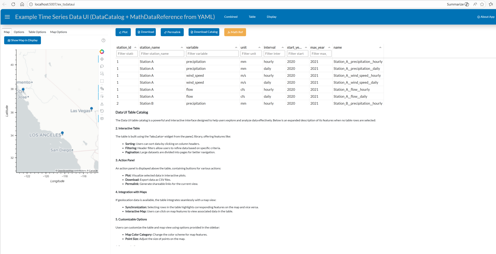
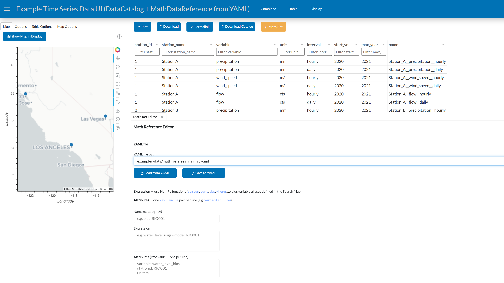
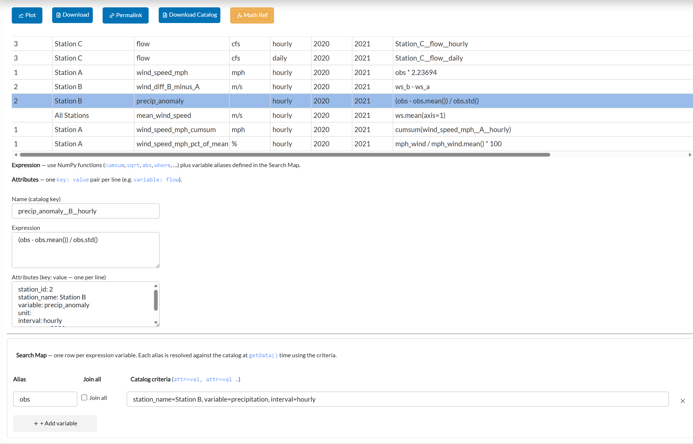
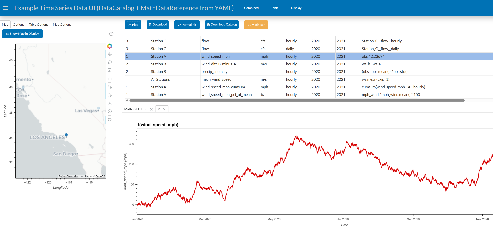

# Math References

A **Math Reference** (`MathDataReference`) is a derived data series whose values are computed from a Python expression evaluated over other series in the catalog. Rather than storing a pre-computed result, it evaluates on demand — every call to `getData()` fetches the underlying source data and applies the expression freshly.

Math References are first-class catalog entries. They appear alongside raw `DataReference` objects in the table, can be plotted, downloaded, and used as inputs to *other* Math References (chaining).



---

## Concepts

### Variable Resolution

When a Math Reference evaluates its expression it resolves each identifier in priority order:

1. **`variable_map`** — an explicit `{alias: DataReference}` binding provided at construction time.
2. **`search_map`** — each alias is looked up in the catalog at `getData()` time using attribute criteria (e.g. `variable=wind_speed, interval=hourly`). This is the *recommended* approach because it keeps expressions portable.
3. **Catalog name-lookup** — if the identifier matches a catalog key directly, that reference is used. This works for simple cases and for chaining one Math Reference into another.

### `ref_type` — distinguishing raw from derived entries

Every `DataReference` carries a `ref_type` class attribute:

| Class | `ref_type` value |
|---|---|
| `DataReference` | `"raw"` |
| `MathDataReference` | `"math"` |
| Custom subclass | Override with `ref_type = "my_type"` in the class body |

`DataCatalog.to_dataframe()` always includes a `ref_type` column. Subclasses
that need to behave differently for derived vs. raw entries can branch on this
value without using `isinstance` checks:

```python
df = catalog.to_dataframe()
math_rows = df[df["ref_type"] == "math"]
```

---

### Available Functions

Expressions run inside a safe NumPy namespace. The following are available without any import:

| Category | Available names |
|---|---|
| Trig | `sin`, `cos`, `tan`, `arcsin`, `arccos`, `arctan`, `arctan2` |
| Exponential / log | `exp`, `log`, `log2`, `log10`, `sqrt` |
| Rounding | `ceil`, `floor`, `round` |
| Array ops | `abs`, `clip`, `where`, `diff`, `cumsum` |
| Aggregates | `min`, `max`, `sum`, `mean`, `std` |
| Constants | `pi`, `e`, `nan`, `inf` |
| Libraries | `np` (NumPy), `pd` (pandas), `math` |

Pandas Series/DataFrame methods are also available directly on resolved variables (e.g. `obs.mean()`, `ws.mean(axis=1)`).

---

## Creating Math References via YAML

The most portable way to define Math References is with a YAML file. Each entry is a list item with at minimum a `name` and an `expression`. All other keys become metadata attributes (shown as table columns in the UI).

### Style 1 — Direct catalog-name lookup (simple cases)

Expression tokens are the full catalog key names of other references. Good for quick one-offs; breaks if the upstream reference is renamed.

#### How catalog names are built

Every `DataReference` has a `.name` property that is its catalog key — the string used to store and retrieve it. There are two ways a name is set:

1. **Assigned explicitly** — in code you set `ref.name = "my_key"` before calling `catalog.add(ref)`.
2. **Generated from `ref_key()`** — the default `DataReference.ref_key()` joins all string-representable attribute values with `_` separators, sanitising spaces and special characters to underscores:
   ```python
   # ref with attributes: station="A", variable="wind", interval="hourly"
   ref.ref_key()  # → "A_wind_hourly"
   ```
   Subclasses can override `ref_key()` to produce a more domain-specific key from a chosen subset of attributes. For example `ex_tsdataui.py` overrides it to use `station_name__variable__interval`:
   ```python
   def ref_key(self) -> str:
       name = self.get_attribute("station_name", "").replace(" ", "_")
       variable = self.get_attribute("variable", "")
       interval = self.get_attribute("interval", "")
       return f"{name}__{variable}__{interval}"
       # → "Station_A__wind_speed__hourly"
   ```

#### Seeing catalog names in the UI

When the catalog contains any Math References, the table gains an **expression** column. For raw `DataReference` rows this column is intentionally filled with the reference's catalog key name — so users can see at a glance exactly what token to paste into an expression:

```python
# Inside get_data_catalog() in ex_tsdataui.py:
mask = df["expression"].isna() | (df["expression"].str.strip() == "")
df.loc[mask, "expression"] = df.loc[mask, "name"]  # show catalog key for raw refs
```

This means the `expression` column doubles as a "name hint" guide: raw rows show the token you'd use in a direct-name expression; Math Reference rows show their actual expression formula.

You can also list all names in code:
```python
catalog.list_names()
# ['Station_A__wind_speed__hourly', 'Station_B__wind_speed__hourly', ...]
```

```yaml
# math_refs_tsdataui.yaml

- name: Station_A__wind_speed_mph__hourly
  expression: Station_A__wind_speed__hourly * 2.23694
  station_id: '1'
  station_name: Station A
  variable: wind_speed_mph
  unit: mph
  interval: hourly

- name: Station_B__precip_cumulative__hourly
  expression: cumsum(Station_B__precipitation__hourly)
  station_id: '2'
  station_name: Station B
  variable: precip_cumulative
  unit: mm
  interval: hourly

- name: wind_diff_A_minus_C__hourly
  expression: Station_A__wind_speed__hourly - Station_C__wind_speed__hourly
  station_id: '1'
  station_name: Station A
  variable: wind_diff_A_minus_C
  unit: m/s
  interval: hourly
```

### Style 2 — `search_map` / alias style (recommended)

Each expression variable is a short alias resolved by catalog attribute criteria at `getData()` time. The expression itself stays the same even if catalog key names change — only the search criteria need to match.

```yaml
# math_refs_search_map.yaml

# Unit conversion: obs → first match for station_name=Station A, variable=wind_speed, interval=hourly
- name: wind_speed_mph__A__hourly
  expression: obs * 2.23694
  station_name: Station A
  variable: wind_speed_mph
  unit: mph
  interval: hourly
  search_map:
    obs:
      station_name: Station A
      variable: wind_speed
      interval: hourly

# Cross-station difference: two independent aliases
- name: wind_diff_B_minus_A__hourly
  expression: ws_b - ws_a
  variable: wind_diff_B_minus_A
  unit: m/s
  interval: hourly
  search_map:
    ws_b:
      station_name: Station B
      variable: wind_speed
      interval: hourly
    ws_a:
      station_name: Station A
      variable: wind_speed
      interval: hourly

# Normalised anomaly (z-score)
- name: precip_anomaly__B__hourly
  expression: (obs - obs.mean()) / obs.std()
  variable: precip_anomaly
  unit: ''
  interval: hourly
  search_map:
    obs:
      station_name: Station B
      variable: precipitation
      interval: hourly

# Multi-station mean: match_all: true concatenates ALL matches into a DataFrame
- name: mean_wind_speed__all_stations__hourly
  expression: ws.mean(axis=1)
  variable: mean_wind_speed
  unit: m/s
  interval: hourly
  search_map:
    ws:
      variable: wind_speed
      interval: hourly
      match_all: true
```

> **`match_all: true`** — when set inside a `search_map` criteria block, *all* catalog entries matching those criteria are fetched and concatenated column-wise (axis=1 join by timestamp index) so the alias resolves to a DataFrame. Use this for multi-station aggregates such as `ws.mean(axis=1)`.

### Regex matching in criteria

By default, every `attr=value` criterion in a `search_map` block (or in a `catalog.search()` call) performs an **exact equality check**. You can switch to a **case-insensitive regular expression** by using `~` instead of `=` as the operator, or by passing a tilde-prefixed string in code.

#### Rules

| Rule | Detail |
|---|---|
| Operator | `~` in the editor/YAML; `"~pattern"` (tilde-prefixed string) in Python |
| Matching | `re.fullmatch` — the pattern must match the **entire** attribute value |
| Case | Case-insensitive (`re.IGNORECASE`) |
| Partial match | Use `.*` to allow leading/trailing characters (e.g. `~EC.*`) |

#### YAML examples

```yaml
search_map:
  # Exact match (default) — only "wind_speed" qualifies, not "wind_speed_mph"
  obs:
    variable: wind_speed
    interval: hourly

  # Regex fullmatch — matches "wind_speed" AND "wind_speed_mph" (starts with "wind_speed")
  obs_any:
    variable: ~wind_speed.*
    interval: hourly

  # Case-insensitive — "EC", "ec", "Ec" all match
  salinity:
    variable: ~ec
    interval: ~15min.*

  # Match several known prefixes with alternation
  flow_or_stage:
    variable: ~(flow|stage)
    interval: hourly
```

#### Python `set_search()` / `search_map` dict examples

```python
# Regex via set_search() — matches "EC", "ec_hourly", "EC_daily", etc.
m = (MathDataReference("obs * 1.0", name="ec_copy")
     .set_search("obs", variable="~EC.*", interval="hourly")
     .set_catalog(catalog))

# Regex in a search_map dict passed to the constructor
m = MathDataReference(
    "a + b",
    search_map={
        "a": {"variable": "~flow.*", "location": "upstream"},
        "b": {"variable": "~flow.*", "location": "downstream"},
    },
    name="net_flow",
)

# catalog.search() with regex — find all refs whose name starts with "station"
refs = catalog.search(name="~station.*")
# catalog.search() with regex attribute — find all EC-family variables
refs = catalog.search(variable="~EC.*")
```

#### Using regex in the editor

Type criteria using `~` instead of `=` to indicate regex:

```
variable~EC.*
variable~EC.*, interval=hourly
```

The **`+attr`** picker always appends `attr=`. To switch to regex, manually replace `=` with `~` in the criteria field after picking the attribute name.

#### Partial vs full match

`re.fullmatch` is used, so the pattern must match the **entire** attribute value, not just a substring:

| Pattern | Attribute value | Matches? |
|---|---|---|
| `~EC` | `"EC"` | ✅ yes — exact fullmatch |
| `~EC` | `"EC_daily"` | ❌ no — `EC` alone doesn't cover `_daily` |
| `~EC.*` | `"EC_daily"` | ✅ yes — `.*` absorbs the suffix |
| `~ec` | `"EC"` | ✅ yes — case-insensitive |
| `~ec` | `"EC_DAILY"` | ❌ no — same fullmatch rule applies |
| `~ec.*` | `"EC_DAILY"` | ✅ yes |
| `~(flow\|stage)` | `"flow"` | ✅ yes |
| `~(flow\|stage)` | `"velocity"` | ❌ no |

#### Limitation — literal `~` values

If a metadata attribute value legitimately starts with `~` (unusual), it **cannot** be matched using `=` with a tilde-prefixed expected value, because any value beginning with `~` is interpreted as a regex pattern. As a workaround, use a callable predicate in Python:

```python
# Match the literal value "~special" exactly
refs = catalog.search(variable=lambda v: v == "~special")
```

This limitation does not apply to the YAML or editor format, where you would simply use `variable=~special` to trigger regex mode.

### Chaining Math References

A Math Reference can reference another Math Reference — either by catalog key name or via `search_map` attributes. All references in the file are created before any `getData()` call, so ordering within the file does not matter.

```yaml
# Chain by name: cumulative sum of the mph-converted series defined above
- name: wind_speed_mph__A__hourly__cumsum
  expression: cumsum(wind_speed_mph__A__hourly)
  variable: wind_speed_mph_cumsum
  unit: mph
  interval: hourly

# Chain by search_map attributes: more portable than using the catalog key
- name: wind_speed_mph__A__hourly__pct_of_mean
  expression: mph_wind / mph_wind.mean() * 100
  variable: wind_speed_mph_pct_of_mean
  unit: '%'
  interval: hourly
  search_map:
    mph_wind:
      station_name: Station A
      variable: wind_speed_mph
      interval: hourly
```

### Loading YAML in code

```python
from dvue.catalog import DataCatalog
from dvue.math_reference import MathDataCatalogReader

catalog = DataCatalog()
# ... add raw DataReference objects ...

reader = MathDataCatalogReader(parent_catalog=catalog)
catalog.add_reader(reader)
catalog.add_source("math_refs_search_map.yaml")
```

### Saving all math refs to YAML in code

```python
from dvue.math_reference import save_math_refs

save_math_refs(catalog, "math_refs_saved.yaml")
```

---

## Creating Math References via the Editor

The **Math Ref** button in the UI opens an inline editor panel for creating, editing, and managing Math References without restarting the kernel.

### Opening the editor

Click the **Math Ref** button (orange/warning style) in the action toolbar above the catalog table. A new tab opens inside the display panel.



The editor is laid out top-to-bottom as follows.

#### Name

The catalog key used to store and retrieve this reference. Must be unique within the catalog.

#### Expression

A Python expression string. Use the short aliases you define in the Search Map (or full catalog key names for direct-lookup style). See [Available Functions](#available-functions) for what is in scope.

#### Alias hint buttons

A row of clickable buttons appears immediately below the Expression field, one per alias currently defined in the Search Map. Clicking a button appends that alias name to the end of the expression — no typing needed. The buttons update live as you add or rename aliases.

#### Attributes

One `key: value` pair per line. These become metadata attributes shown as columns in the catalog table (e.g. `variable`, `unit`, `interval`, `station_name`).

#### Search Map

One row per expression variable. Rows can be added with **+ Add variable** and removed with the **✕** button.

| Field | Purpose |
|---|---|
| **Alias** | Short identifier used in the Expression (e.g. `obs`) |
| **Match all** | When checked, all matching catalog entries are concatenated into a DataFrame (equivalent to `match_all: true` in YAML) |
| **Catalog criteria** | Comma-separated `attr=val` (exact) or `attr~regex` (regex fullmatch) pairs used to search the catalog (e.g. `variable=wind_speed, interval=hourly` or `variable~EC.*, interval=hourly`) |
| **+ attr** | Drop-down picker; selecting an attribute name appends `attr=` to the criteria field so you only need to fill in the value |
| **▶** | Per-row test button — runs the criteria against the live catalog and shows an inline badge: `✅ 1 match`, `⚠️ N matches`, or `❌ 0 matches`. If exactly one match is found and the **Attributes** field is empty, it is auto-filled with the match's identifying attributes |

**Criteria pre-fill from the table** — if you have a row selected in the catalog table when you click **+ Add variable**, the new row's criteria field is pre-populated with the identifying attributes of the selected row (station ID, variable, interval, etc.), saving manual typing.

#### Test Expression

The **Test Expression** button (▶ Play icon) evaluates the full expression against the live catalog and shows the result immediately below the button — shape, and the first five rows as a table. Any errors (unresolved aliases, type mismatches, etc.) are reported inline.

#### Catalog attribute browser

A read-only section listing every attribute column currently in the catalog and its unique values — use this as a reference when writing search criteria.

#### YAML — Upload / Download

- **Upload YAML** — choose a `.yaml` / `.yml` file from your computer and click **Load Uploaded YAML**. All `MathDataReference` entries in the file are merged into the live catalog and the table refreshes. No server-side path is required.
- **Download YAML** — downloads all current Math References in the catalog as a single YAML file to your browser's downloads folder. The file is in the canonical flat format and can be re-uploaded later.

#### Save

Click **Save** to add the reference to the live catalog and refresh the table. After saving, the Name, Expression, and Attributes fields are cleared so you can immediately create the next reference. The Search Map rows are preserved — useful when creating a series of similar references that share the same variable criteria.

If a reference with the same name already exists it is replaced in-place.

### Editing an existing Math Reference

Select a row in the catalog table that corresponds to a Math Reference before clicking **Math Ref**. The editor pre-populates Name, Expression, Attributes, and all Search Map rows from the selected reference.



### Plotting a Math Reference

Once a Math Reference is in the catalog it can be selected and plotted just like any raw data series. The expression is evaluated on demand against the live catalog data.



---

## Creating Math References in Python

You can also construct `MathDataReference` objects directly in code:

```python
from dvue.catalog import DataCatalog, DataReference
from dvue.math_reference import MathDataReference

# Explicit variable_map
a = DataReference(df_a, name="A")
b = DataReference(df_b, name="B")
derived = MathDataReference("A + B * 2", variable_map={"A": a, "B": b}, name="sum_AB")

# Operator overloading shorthand (produces a MathDataReference automatically)
combined = a + b * 2
combined.name = "sum_AB"

# search_map style — resolves against a catalog at getData() time
cat = DataCatalog()
# ... populate cat ...
m = MathDataReference(
    "inflow - outflow",
    search_map={
        "inflow":  {"variable": "discharge", "location": "upstream"},
        "outflow": {"variable": "discharge", "location": "downstream"},
    },
    catalog=cat,
    name="net_discharge",
)
cat.add(m)
```

### Fluent / chainable API

```python
m = (MathDataReference("obs * 2.23694", name="wind_mph")
     .set_search("obs", variable="wind_speed", interval="hourly", station_name="Station A")
     .set_catalog(catalog))
catalog.add(m)
```

---

## Wire the editor into your `TimeSeriesDataUIManager`

`TimeSeriesDataUIManager` includes the **Math Ref** editor by default — no extra wiring required. The button is shown automatically whenever `show_math_ref_editor` is `True` (the default).

To hide it for a specific manager instance:

```python
mgr.show_math_ref_editor = False
# or pass it to the constructor:
mgr = MyManager(catalog, show_math_ref_editor=False)
```

To customise the suggested download filename or add the action to a manager that does not inherit from `TimeSeriesDataUIManager`:

```python
from dvue.math_ref_editor import MathRefEditorAction

class MyManager(TimeSeriesDataUIManager):

    @property
    def data_catalog(self):
        return self._catalog          # required: expose the DataCatalog

    def get_data_actions(self):
        actions = super().get_data_actions()
        actions.append(dict(
            name="Math Ref",
            button_type="warning",
            icon="math-function",
            action_type="display",
            callback=MathRefEditorAction(default_yaml_filename="my_math_refs.yaml").callback,
        ))
        return actions
```

`default_yaml_filename` sets the suggested filename when the user clicks **Download YAML** in the editor.

---

## Creating Math References from the Transform panel

The **Transform → Ref** button (green, in the action toolbar) converts the currently-active
transforms into a `MathDataReference` and saves it to the live catalog in a single click —
no expression authoring needed.

### Prerequisites

1. Select one or more rows in the catalog table.
2. Apply at least one transform in the **Transform** tab (see [Transforms](#transforms)).
3. Click **Transform → Ref**.

A notification confirms each new reference added. If a reference with the same derived name
already exists it is silently replaced with the updated one.

### Transform tab controls

| Section | Controls |
|---|---|
| **Data Cleanup** | `fill_gap` — fill missing values |
| **Resampling** | Period string (`1D`, `1H`, `15min`, …) + aggregation (`mean`, `max`, `min`, `sum`, `std`) |
| **Smoothing** | Tidal filter (cosine-Lanczos 40 h) + Rolling window (offset string `24H`, `7D`, …) + aggregation |
| **Derived** | Differencing (`diff_periods`) + cumulative sum |
| **Scaling** | Scale factor (multiplicative constant; `1.0` = no-op) |

### How the expression is built

Transforms are combined into a single chained pandas expression applied to the variable `x`:

| Active transforms | Expression |
|---|---|
| Resample 1D mean | `x.resample('1D').mean()` |
| Tidal filter then resample | `cosine_lanczos(x, '40h').resample('1D').mean()` |
| Rolling 24H mean | `x.rolling('24H').mean()` |
| Differencing (1 period) | `x.diff(1)` |
| Cumulative sum | `x.cumsum()` |
| Scale by 0.3048 | `x * 0.3048` |
| Resample + scale | `x.resample('1D').mean() * 0.3048` |

> **Pipeline order**: tidal filter → resample → rolling → diff → cumsum → scale.
> The tidal filter is always applied on the original sub-daily series; resampling comes after.

### How the name is built

```
[f{n}_]{identity_key}__{tag}
```

| Part | Meaning |
|---|---|
| `f{n}_` | File index prefix, only in multi-file catalogs (e.g. `f0_`, `f1_`) |
| `{identity_key}` | Short identity of the source reference (e.g. `RSAC054_FLOW`) |
| `__` | Unambiguous separator — the sanitiser never produces `__` inside an identity key |
| `{tag}` | Short code for the active transforms (see table below) |

#### Transform tags

| Active transform | Tag |
|---|---|
| Tidal filter | `tf` |
| Resample 1D mean | `1D_mean` |
| Resample 1H max | `1H_max` |
| Rolling 24H mean | `r24H_mean` |
| Differencing (1 period) | `diff` |
| Differencing (N periods) | `diffN` |
| Cumulative sum | `cumsum` |
| Scale by 2.0 | `x2.0` |

Multiple active transforms are joined with `_`:
```
resample_period=1D + scale_factor=0.3048  →  name: RSAC054_FLOW__1D_mean_x0.3048
```

### Controlling the identity key

The identity part of the name comes from **one of three sources**, checked in priority order:

1. **`ref.set_key_attributes([...])`** — set directly on the original `DataReference`.
   The ref itself advertises which attributes constitute its identity.
   ```python
   ref.set_key_attributes(["B", "C"])   # DSS station (B) + variable (C)
   # → identity key: "RSAC054_FLOW"
   ```

2. **`manager.identity_key_columns = [...]`** — a catalog-level default on the manager.
   All refs in this catalog use the same attribute names for their identity.
   ```python
   mgr.identity_key_columns = ["B", "C"]
   # → every Transform → Ref uses B+C as the identity part
   ```

3. **Fallback** — neither source is set. The full `ref_key()` is used. This is verbose
   (includes all non-source attributes), but always produces a valid, unique name.

### Attribute inheritance

The new `MathDataReference` inherits **all attributes** from the original ref except `source`
(the file path). This means it is groupable and filterable by the same station, variable, and
interval criteria as the source:

```
Original ref:  B=RSAC054, C=FLOW, E=1HOUR, F=STUDY_V1, filename=base.dss
New math ref:  B=RSAC054, C=FLOW, E=1HOUR, F=STUDY_V1+1D_mean
                                              ↑ original F  ↑ transform tag appended
```

When the original ref has no `F` attribute, a `transform` attribute is added instead:
```
New math ref:  B=RSAC054, C=FLOW, transform=1D_mean
```

### Hiding the button

```python
mgr.show_transform_to_catalog = False
```

---

## Transforms

`TimeSeriesDataUIManager` applies an in-memory transform pipeline to every plotted series.
Transforms are controlled from the **Transform** tab in the sidebar.

> **Note**: transforms affect only what is plotted and what **Transform → Ref** captures.
> They do not modify the underlying data in the catalog.

### Pipeline order

```
raw data
  → fill gap
  → tidal filter (cosine-Lanczos 40 h)
  → resample (period + aggregation)
  → rolling window (offset + aggregation)
  → differencing (n periods)
  → cumulative sum
  → scale factor
```

### Params reference

| Param | Type | Default | Notes |
|---|---|---|---|
| `resample_period` | `str` | `""` | Pandas offset string (`"1D"`, `"1H"`, `"15min"`, …). Empty = disabled |
| `resample_agg` | selector | `"mean"` | `mean`, `max`, `min`, `sum`, `std` |
| `rolling_window` | `str` | `""` | Pandas offset string (`"24H"`, `"7D"`, …). Empty = disabled |
| `rolling_agg` | selector | `"mean"` | `mean`, `max`, `min`, `std` |
| `do_diff` | `bool` | `False` | Apply `Series.diff(diff_periods)` |
| `diff_periods` | `int` | `1` | Number of periods for differencing |
| `do_cumsum` | `bool` | `False` | Apply `Series.cumsum()` |
| `scale_factor` | `float` | `1.0` | Multiply every value; `1.0` is a no-op |
| `show_transform_to_catalog` | `bool` | `True` | Show "Transform → Ref" action button |
| `identity_key_columns` | `list[str]` | `[]` | Attribute names forming the identity key for derived ref names |

---

## Full working example

See [`examples/ex_tsdataui.py`](examples/ex_tsdataui.py) for a complete end-to-end demonstration:

```bash
conda run -n pydsm panel serve examples/ex_tsdataui.py --show
```

The example includes:
- A `DataCatalog` with 18 raw station/variable/interval references
- Two ready-made YAML files in `examples/data/`:
  - [`math_refs_tsdataui.yaml`](examples/data/math_refs_tsdataui.yaml) — direct catalog-name lookup style
  - [`math_refs_search_map.yaml`](examples/data/math_refs_search_map.yaml) — `search_map` alias style (6 examples including chaining and `[multi]`)
- The **Math Ref** editor action pre-wired and ready to use
